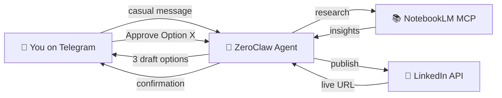

# 🤖 Autonomous Branding Agent (ABA)

> An AI-powered personal branding assistant built on [ZeroClaw](https://github.com/zeroclaw-labs/zeroclaw) that lives in Telegram, researches your technical projects via NotebookLM, and publishes polished LinkedIn posts — all with human-in-the-loop safety.



## ✨ Features

- **Intent-Driven** — Send casual, unstructured messages; the agent infers intent without rigid templates
- **Deep Research** — Autonomously ingests GitHub repos and docs via NotebookLM MCP
- **3-Option Drafting** — Always presents Deep Dive 🔬, Storytelling 📖, and Punchy ⚡ variants
- **Token-Efficient by Default** — Concise-first replies, on-demand memory loading, and batched tool operations
- **Guardrailed Publishing** — Hard-coded safety: requires exact "Approve Option X" before posting
- **Self-Synthesizing Tool-Maker** — Detects missing capabilities, generates new skills in sandbox, and requests HITL approval before deployment
- **Persistent Memory** — Remembers past projects and your content preferences across sessions
- **Operationally Clear** — Documentation and governance are maintained in enterprise-grade English

## 📋 Prerequisites

| Requirement | Version | Purpose |
|---|---|---|
| [Rust](https://www.rust-lang.org/tools/install) | Stable | Running ZeroClaw |
| [Python](https://python.org) | ≥ 3.10 | LinkedIn scripts & NotebookLM MCP |
| [uv](https://docs.astral.sh/uv/) | Latest | Python package manager |
| [ZeroClaw](https://github.com/zeroclaw-labs/zeroclaw) | Latest | Agent framework |
| Telegram Account | — | Bot channel |
| LinkedIn Developer App | — | Publishing API |
| Google Account | — | NotebookLM access |

## 🚀 Setup Guide

### Step 1: Install ZeroClaw
```bash
# Option A (recommended): download prebuilt binary from
# https://github.com/zeroclaw-labs/zeroclaw/releases/latest

# Option B (build from source)
cargo install --git https://github.com/zeroclaw-labs/zeroclaw --locked zeroclaw
```

### Step 2: Clone / Navigate to This Project
```bash
cd d:\programming\automation\AABP-agent
```

### Step 3: Create Your Telegram Bot
1. Open Telegram and chat with [@BotFather](https://t.me/BotFather)
2. Send `/newbot` → follow the prompts
3. Copy the **Bot Token** you receive

### Step 4: Set Up LinkedIn Developer App
1. Go to [LinkedIn Developer Portal](https://www.linkedin.com/developers/apps)
2. Create a new app
3. Under **Products**, enable **"Share on LinkedIn"**
4. Under **Auth**, note your **Client ID** and **Client Secret**
5. Add redirect URI: `http://localhost:3000/callback`

### Step 5: Configure Environment
```bash
# Copy the template
copy .env.example .env

# Edit .env and fill in your values:
# - TELEGRAM_BOT_TOKEN
# - OPENAI_API_KEY
# - LINKEDIN_CLIENT_ID
# - LINKEDIN_CLIENT_SECRET
```

### Step 6: Install Python Dependencies
```bash
uv sync
```

### Step 7: Install NotebookLM MCP
```bash
uv tool install notebooklm-mcp-server
notebooklm-mcp-auth
```
This opens Chrome for Google authentication. Login and the cookies are saved automatically.

### Step 8: Run LinkedIn OAuth
```bash
uv run skills\linkedin-publish\scripts\linkedin_oauth.py
```
This opens your browser for LinkedIn authorization and saves the access token to `.env`.

### Step 9: Create ZeroClaw Config
```bash
copy zeroclaw.config.toml.example %USERPROFILE%\.zeroclaw\config.toml
```
Then edit `%USERPROFILE%\.zeroclaw\config.toml` and set `bot_token`.

### Step 10: Start the Agent
```bash
zeroclaw daemon
```
Your bot should come online in Telegram. Send it a message to test!

## 💬 Usage Examples

### Research + Draft
```
You: "Review this WhaleWatcher repo https://github.com/user/whalewatcher
  and generate 3 LinkedIn post options"

Agent: "Understood. I am reviewing the repository via NotebookLM... ⏳"
       [researches autonomously]
       [presents 3 draft options]
```

### Revise a Draft
```
You: "Revise Option 2, make it more conversational, and add a real-time pipeline mention"

Agent: [presents revised Option 2 only]
```

### Publish
```
You: "Approve Option 2"

Agent: "Post published successfully! 🎉 https://linkedin.com/feed/update/..."
```

### Auto Tool-Maker (Skill Gap)
```bash
# 1) Detect skill gap from user instruction
python skills\tool-maker\scripts\trigger_tool_maker_skill.py \
  --instruction "ambil data saham AAPL 30 hari terakhir"

# 2) Generate & sandbox test skill (max 3 auto-fix iterations)
python skills\tool-maker\scripts\tool_maker.py generate \
  --payload-file tmp_payload.json

# 3) Send HITL approval to Telegram
python skills\tool-maker\scripts\tool_maker.py notify \
  --bundle-file skills\tool-maker\staging\<request_id>\bundle.json \
  --chat-id <telegram_chat_id>
```

### Test Publishing (Dry Run)
```bash
uv run skills\linkedin-publish\scripts\linkedin_post.py \
  --text "Test post content" \
  --hashtags "#AI #Test" \
  --dry-run
```

## 📁 Project Structure

```
AABP-agent/
├── zeroclaw.config.toml.example  # ZeroClaw config template
├── pyproject.toml         # Python deps managed by uv
├── .env                   # API keys and secrets (git-ignored)
├── .env.example           # Template with documentation
├── .gitignore
│
├── AGENTS.md              # Agent operating instructions (ReAct loop)
├── SOUL.md                # Agent persona (tone, rules, guardrails)
├── USER.md                # User profile (Eggi Satria)
├── MEMORY.md              # Persistent memory (auto-managed)
│
├── skills/
│   ├── notebooklm-research/
│   │   └── SKILL.md       # NotebookLM research workflow
│   │
│   ├── tool-maker/
│   │   ├── SKILL.md        # Dynamic skill generation (EPIC 5)
│   │   └── scripts/
│   │       ├── trigger_tool_maker_skill.py
│   │       ├── tool_maker.py
│   │       └── base_skill_contract.py
│   │
│   └── linkedin-publish/
│       ├── SKILL.md        # Publishing skill + guardrails
│       └── scripts/
│           ├── linkedin_oauth.py   # OAuth 2.0 setup flow
│           ├── linkedin_post.py    # Post publisher (with dry-run)
│           └── requirements.txt    # Python dependencies
│
└── README.md              # This file
```

## 🔒 Security

- **Guardrails**: Hard-coded rule prevents publishing without explicit `Approve Option X`
- **Secrets**: All API keys in `.env`, never committed to git
- **Rate Limiting**: `maxToolCalls: 25` prevents runaway LLM costs
- **Auth Isolation**: LinkedIn OAuth tokens scoped to `w_member_social` only

## 🔧 Troubleshooting

| Issue | Solution |
|---|---|
| Bot not responding in Telegram | Check `TELEGRAM_BOT_TOKEN` in `.env` |
| NotebookLM tools not appearing | Run `notebooklm-mcp-auth` to refresh auth |
| LinkedIn 401 error | Re-run `linkedin_oauth.py` to refresh token |
| LinkedIn 403 error | Enable "Share on LinkedIn" in developer portal |
| Agent not responding | Run `zeroclaw status` and `zeroclaw channel doctor` |
| Config changes not applied | Restart runtime with `zeroclaw daemon` |
| High token costs | Use smaller model in `%USERPROFILE%\.zeroclaw\config.toml` and set `[skills].prompt_injection_mode = "compact"` |

## 💸 Token Efficiency Defaults

- `AGENTS.md` now enforces **concise-first mode** for normal replies (1-2 paragraphs).
- `MEMORY.md` is treated as an **active snapshot**, while long history should be archived to `docs/memory-log-YYYY-MM-DD.md`.
- `zeroclaw.config.toml.example` is tuned for lower overhead:
  - `max_history_messages = 20`
  - `max_tool_iterations = 8`
  - `default_temperature = 0.4`
- Tool-Maker LLM generation now trims oversized payload fields and uses explicit `max_tokens`.

##  License

MIT
