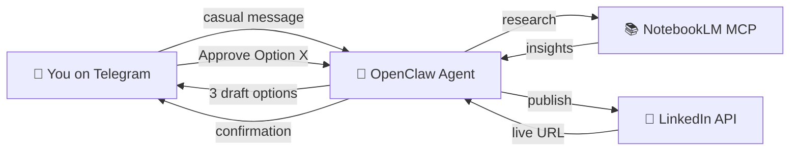

# 🤖 Autonomous Branding Agent (ABA)

> An AI-powered personal branding assistant built on [OpenClaw](https://openclaw.ai) that lives in Telegram, researches your technical projects via NotebookLM, and publishes polished LinkedIn posts — all with human-in-the-loop safety.



## ✨ Features

- **Intent-Driven** — Send casual messages in Bahasa Indonesia; the agent understands what you want
- **Deep Research** — Autonomously ingests GitHub repos and docs via NotebookLM MCP
- **3-Option Drafting** — Always presents Deep Dive 🔬, Storytelling 📖, and Punchy ⚡ variants
- **Guardrailed Publishing** — Hard-coded safety: requires exact "Approve Option X" before posting
- **Persistent Memory** — Remembers past projects and your content preferences across sessions
- **Bilingual** — Bahasa Indonesia with English technical terms (best of both worlds)

## 📋 Prerequisites

| Requirement | Version | Purpose |
|---|---|---|
| [Node.js](https://nodejs.org) | ≥ 18 | Running OpenClaw |
| [Python](https://python.org) | ≥ 3.10 | LinkedIn scripts & NotebookLM MCP |
| [uv](https://docs.astral.sh/uv/) | Latest | Python package manager |
| [OpenClaw](https://openclaw.ai) | Latest | Agent framework |
| Telegram Account | — | Bot channel |
| LinkedIn Developer App | — | Publishing API |
| Google Account | — | NotebookLM access |

## 🚀 Setup Guide

### Step 1: Install OpenClaw
```bash
npm install -g openclaw
```

### Step 2: Clone / Navigate to This Project
```bash
cd d:\programming\automation\AABP-agent
```

### Step 3: Create Your Telegram Bot
1. Open Telegram and chat with [@BotFather](https://t.me/BotFather)
2. Send `/newbot` → follow the prompts
3. Copy the **Bot Token** you receive

### Step 4: Set Up LinkedIn Developer App
1. Go to [LinkedIn Developer Portal](https://www.linkedin.com/developers/apps)
2. Create a new app
3. Under **Products**, enable **"Share on LinkedIn"**
4. Under **Auth**, note your **Client ID** and **Client Secret**
5. Add redirect URI: `http://localhost:3000/callback`

### Step 5: Configure Environment
```bash
# Copy the template
copy .env.example .env

# Edit .env and fill in your values:
# - TELEGRAM_BOT_TOKEN
# - OPENAI_API_KEY
# - LINKEDIN_CLIENT_ID
# - LINKEDIN_CLIENT_SECRET
```

### Step 6: Install Python Dependencies
```bash
uv sync
```

### Step 7: Install NotebookLM MCP
```bash
uv tool install notebooklm-mcp-server
notebooklm-mcp-auth
```
This opens Chrome for Google authentication. Login and the cookies are saved automatically.

### Step 8: Run LinkedIn OAuth
```bash
uv run skills\linkedin-publish\scripts\linkedin_oauth.py
```
This opens your browser for LinkedIn authorization and saves the access token to `.env`.

### Step 9: Start the Agent
```bash
openclaw gateway run
```
Your bot should come online in Telegram. Send it a message to test!

## 💬 Usage Examples

### Research + Draft
```
You: "Baca repo WhaleWatcher ini https://github.com/user/whalewatcher 
      dan buatin 3 opsi post LinkedIn"

Agent: "Baik, saya sedang membaca repositori tersebut via NotebookLM... ⏳"
       [researches autonomously]
       [presents 3 draft options]
```

### Revise a Draft
```
You: "Revisi opsi 2, buat lebih santai dan tambah mention soal real-time pipeline"

Agent: [presents revised Option 2 only]
```

### Publish
```
You: "Approve Option 2"

Agent: "Post berhasil dipublikasikan! 🎉 https://linkedin.com/feed/update/..."
```

### Test Publishing (Dry Run)
```bash
uv run skills\linkedin-publish\scripts\linkedin_post.py \
  --text "Test post content" \
  --hashtags "#AI #Test" \
  --dry-run
```

## 📁 Project Structure

```
AABP-agent/
├── openclaw.json          # OpenClaw config (Telegram, OpenAI, MCP)
├── pyproject.toml         # Python deps managed by uv
├── .env                   # API keys and secrets (git-ignored)
├── .env.example           # Template with documentation
├── .gitignore
│
├── AGENTS.md              # Agent operating instructions (ReAct loop)
├── SOUL.md                # Agent persona (tone, rules, guardrails)
├── USER.md                # User profile (Eggi Satria)
├── MEMORY.md              # Persistent memory (auto-managed)
│
├── skills/
│   ├── notebooklm-research/
│   │   └── SKILL.md       # NotebookLM research workflow
│   │
│   └── linkedin-publish/
│       ├── SKILL.md        # Publishing skill + guardrails
│       └── scripts/
│           ├── linkedin_oauth.py   # OAuth 2.0 setup flow
│           ├── linkedin_post.py    # Post publisher (with dry-run)
│           └── requirements.txt    # Python dependencies
│
└── README.md              # This file
```

## 🔒 Security

- **Guardrails**: Hard-coded rule prevents publishing without explicit `Approve Option X`
- **Secrets**: All API keys in `.env`, never committed to git
- **Rate Limiting**: `maxToolCalls: 25` prevents runaway LLM costs
- **Auth Isolation**: LinkedIn OAuth tokens scoped to `w_member_social` only

## 🔧 Troubleshooting

| Issue | Solution |
|---|---|
| Bot not responding in Telegram | Check `TELEGRAM_BOT_TOKEN` in `.env` |
| NotebookLM tools not appearing | Run `notebooklm-mcp-auth` to refresh auth |
| LinkedIn 401 error | Re-run `linkedin_oauth.py` to refresh token |
| LinkedIn 403 error | Enable "Share on LinkedIn" in developer portal |
| Agent enters infinite loop | Check OpenClaw logs; `maxToolCalls` limits this |
| High token costs | Switch `gpt-4o-mini` as primary model in `openclaw.json` |

## 📄 License

MIT
